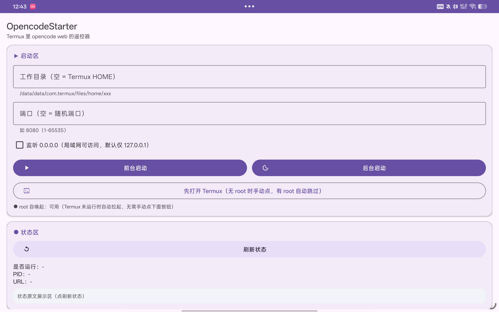
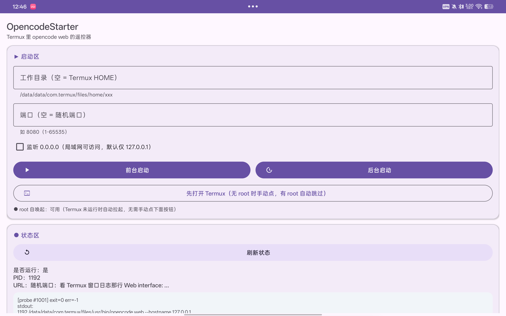
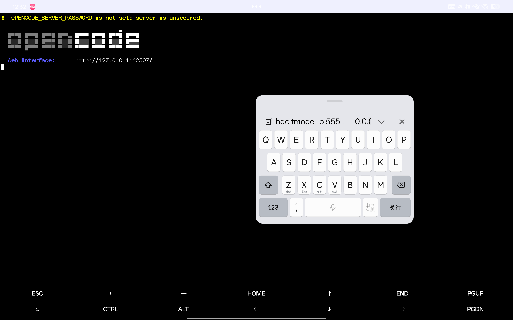
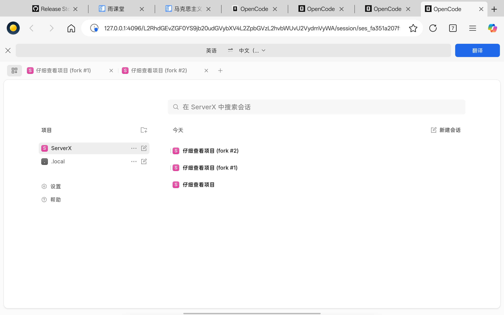

# OpencodeStarter

> Android 遥控器：在手机上点几下，就在 Termux 里把 `opencode web` 跑起来。
> App 本身不跑 opencode，只经 Termux 官方 [`RUN_COMMAND` Intent](https://github.com/termux/termux-app/wiki/RUN_COMMAND-Intent) 给 Termux 发指令。



## 功能

| 区 | 内容 |
|---|---|
| ▶ 启动区 | 工作目录（空 = Termux HOME）+ 端口（空 = 随机，1-65535 校验）+ 0.0.0.0 开关；**前台启动** / **后台启动** |
| ● 状态区 | **刷新状态**：Termux 侧跑只读探活脚本，回显原文 + 解析三行（是否运行 / PID / URL） |
| ■ 管控区 | **停止**（`pkill`，二次确认，幂等）/ **重启**（停完按当前输入重发） |
| ⓘ 说明区 | 前置条件与已知限制速查 |
| ● root 自唤起 | 有 root 时 Termux 没运行会自动拉起，全程零手动、零弹窗（见下） |



## 快速开始

1. 手机上装好 Termux（推荐 GitHub 版 0.118.x），Termux 内装好 `opencode` 且 `opencode web` 可跑。
2. Termux 内执行一次（只需一次）：
   ```bash
   echo 'allow-external-apps = true' >> ~/.termux/termux.properties
   ```
   然后重启 Termux（或跑 `termux-reload-settings`）。
3. 系统设置 → 应用 → OpencodeStarter → 附加权限 → 打开 **Run commands in Termux**。
4. （可选，有 root 更省事）给 OpencodeStarter root 授权（KernelSU / Magisk 点允许即可）。
5. 打开 OpencodeStarter：输入留空可直接点，**后台启动** → **刷新状态** 看到 `是否运行：是` 即成功。
6. 在同一手机浏览器打开 URL（固定端口就是 `http://127.0.0.1:端口/`，随机端口看 Termux 窗口日志）。





## 前台启动 vs 后台启动

- **前台启动**：Termux 被切到前台可见终端，日志直看 `Web interface: http://127.0.0.1:端口/` 那行。注意 Termux 默认返回键只退回 App（session 仍在），最终用「停止」清理。
- **后台启动**：Termux 不抢前台，App 内点刷新看 pgrep 回执。适合「起了就切浏览器用」的场景。

## root 自唤起（可选）

痛点：Termux 进程没起来时，外部 App 的 `RUN_COMMAND` 会被系统静默吞掉（无反应）；Oplus/ColorOS 上跨应用拉 Termux 还会弹确认框。

有 root 时本 App 全自动绕过两者：每次发指令前先 `su -c pidof com.termux` 查活，没活就 `su -c am start …TermuxActivity` 拉起（走 shell 通道，无跨应用弹窗），最多等 9 秒就绪再发。前台启动的切屏同样走 root 通道。

- 启动页有状态行：`● root 自唤起：可用` / `○ root 自唤起：不可用（请手动点下面按钮…）`。
- 无 root 时全部回退老链路：点「先打开 Termux」手动开一次并挂后台即可，功能不受影响。
- App 默认按无 root 设计，root 只做唤起，不写进主流程，不读用户数据。

## RUN_COMMAND 规范对照表

以 Termux **0.118.3** / 官方 Wiki 为准（`master` 分支多了几个 0.118.x 没有的 extra，别抄错）。

| 项目 | 值 |
|---|---|
| action | `com.termux.RUN_COMMAND`（注意**不是** `com.termux.app.action.RUN_COMMAND`） |
| component | `com.termux` / `com.termux.app.RunCommandService` |
| 发送方权限 | `com.termux.permission.RUN_COMMAND`（manifest 声明 + 系统设置手动授予） |

| Extra key 全称 | 类型 | 说明 |
|---|---|---|
| `com.termux.RUN_COMMAND_PATH` | String，唯一必填 | 可执行文件绝对路径，本 App 用 `…/usr/bin/opencode` 或 `…/usr/bin/bash` |
| `com.termux.RUN_COMMAND_ARGUMENTS` | String[] | 参数，如 `["web", "--hostname", "127.0.0.1"]`（端口为空就不拼 `--port`） |
| `com.termux.RUN_COMMAND_STDIN` | String | 本 App 未用（探活/停止走 `bash -c` 参数） |
| `com.termux.RUN_COMMAND_WORKDIR` | String | 为空不传，Termux 默认 `~/` |
| `com.termux.RUN_COMMAND_BACKGROUND` | boolean，默认 false | 前台启动 false，后台/探活/停止 true |
| `com.termux.RUN_COMMAND_SESSION_ACTION` | String `"0"` | 前台用 `"0"`（切到新 session 并打开 Termux） |
| `com.termux.RUN_COMMAND_COMMAND_LABEL` | String | 命令 label（失败弹窗用） |
| `com.termux.RUN_COMMAND_PENDING_INTENT` | PendingIntent | **唯一**结果回执通道，`ResultReceiver` 不被支持 |

结果 Bundle：外层 key 为 `result`，内含 `stdout` / `stderr` / `exitCode`(int) / `err`(int，`-1`=OK) / `errmsg` / `stdout_original_length` / `stderr_original_length`。`am startservice` 构造不出 PendingIntent所以拿不到回执，必须走 Java/Kotlin 代码。

核心组装见 [`TermuxCommand.kt`](app/src/main/java/com/opencodestarter/TermuxCommand.kt)，回执接收见 [`PluginResultsService.kt`](app/src/main/java/com/opencodestarter/PluginResultsService.kt)。

## 探活脚本

```bash
# 端口已知时
pgrep -af 'opencode (web|serve)'; echo ---; curl -s -o /dev/null -w '%{http_code}\n' http://127.0.0.1:<端口>/
# 端口为空（随机）时只跑 pgrep，不 curl
pgrep -af 'opencode (web|serve)'; echo ---; echo no-port-specified
```

停止：`pkill -f 'opencode (web|serve)'`（幂等，可重复点）。重启 = 停止后按当前输入 + 上次模式重发。

## 已知限制（Termux 侧行为，非 Bug）

1. 空端口 = 随机端口，URL 需看 Termux 窗口日志 `Web interface` 那行。
2. 前台命令回执是 stdout+stderr 混合 transcript，不分流。
3. `stdout+stderr` 合计截断约 100KB，超长看 Termux 窗口或重定向到文件。
4. `am startservice` 拿不到回执，必须 Java+PendingIntent。
5. `targetSdk >= 30` 需 `queries` 声明 `com.termux`（本 App 已声明），否则 intent 发不出去。
6. 部分国产 ROM 杀后台激进：把 Termux 加入电池优化白名单。

## 本地构建

```bash
export ANDROID_HOME=/opt/homebrew/share/android-commandlinetools  # 按你的 SDK 路径改
./gradlew assembleDebug     # 调试包：app/build/outputs/apk/debug/app-debug.apk
./gradlew assembleRelease   # release 包（需 keystore.properties，见下）
adb install -r app/build/outputs/apk/debug/app-debug.apk
```

环境：AGP 8.7.3 + Kotlin 2.0.21 + compileSdk 36 + targetSdk 34 + minSdk 26，无 Compose（经典 Views + Material3，包体 ~5MB，亮暗色都正常）。

Release 签名：复制一份签名配置即可——

```properties
# keystore.properties（gitignored，不进仓库）
storeFile=release.keystore
storePassword=<你的密码>
keyAlias=opencodestarter
keyPassword=<你的密码>
```

```bash
keytool -genkeypair -keystore release.keystore -alias opencodestarter \
  -keyalg RSA -keysize 2048 -validity 10000
```

没有 `keystore.properties` 时 `assembleRelease` 照样能编（未签名包，仅本地调试用）。

## FAQ

- **点了没反应？** 三件套：`allow-external-apps=true` + 附加权限 + Termux 在后台（有 root 则最后一条自动满足）。
- **Oplus/ColorOS 弹"想要打开 Termux"？** 无 root 跳转首次会弹，选「始终允许打开」；有 root 走 shell 通道，不弹。
- **收不到回执？** 确认 Termux ≥ 0.109；`ResultReceiver` 和 `am` 本来就没回执，用 App 内按钮（PendingIntent）即可。
- **端口被占？** 换个端口点重启，或进 Termux 手动 `pkill -f 'opencode (web|serve)'`。

## 真机实测（OPD2513 / Android 16 / Termux 0.118.3 / opencode 1.18.21）

- 后台启动（空输入）→ `19534 opencode web --hostname 127.0.0.1`，`ss` 见 `127.0.0.1:4096 LISTEN`
- 刷新 → `[probe #1001] exit=0 err=-1`，「是否运行：是 / PID：19534」
- 停止 → pgrep 空；重启 → 新 PID 出现；重复点不炸
- 前台启动 → Termux 置顶，可见 `Web interface: http://127.0.0.1:42507/`
- root 冷机（`force-stop com.termux` 后直接点后台启动）→ Termux + opencode 全自动起来，零弹窗，Edge 开 `127.0.0.1:4096` 即进 Web UI（上图 04）

## License

MIT
