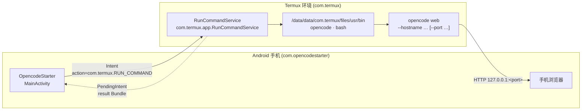
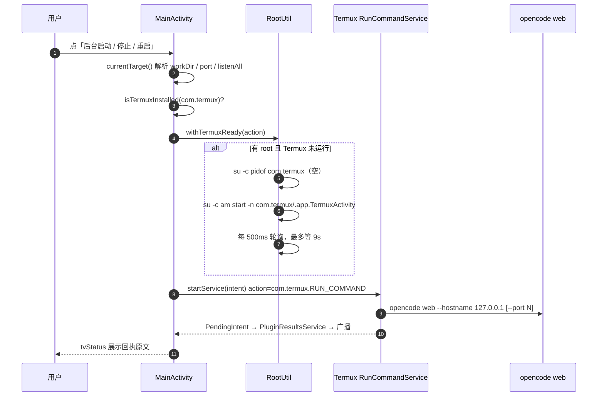
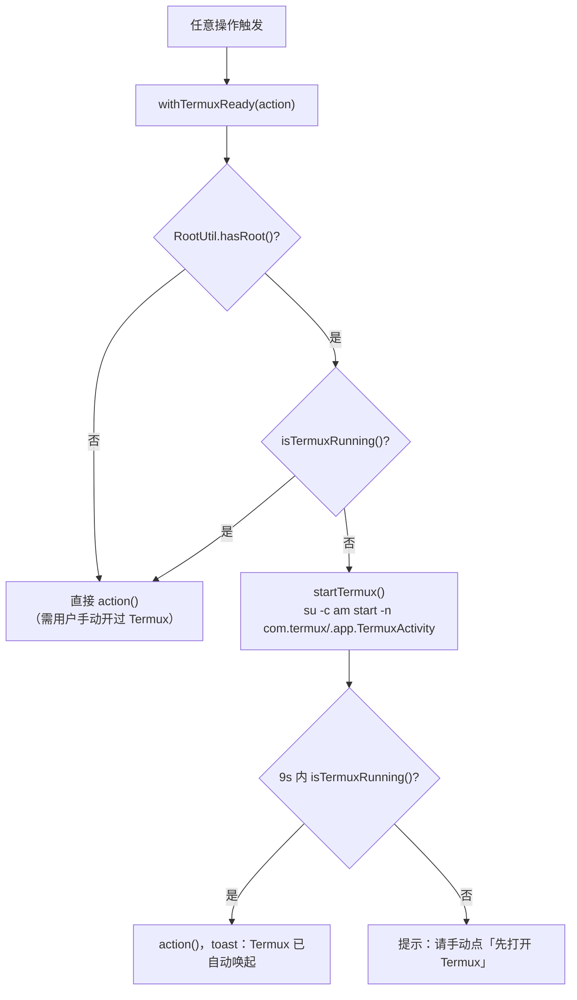
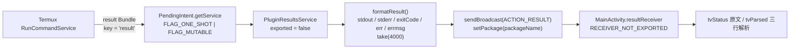

<div align="center">

> [English](./README_en.md) | **简体中文**


# OpencodeStarter — Android 上的 opencode web 遥控器

**手机点两下，Termux 里的 `opencode web` 就跑起来 —— 启动 / 探活 / 停止 / 重启，有 root 还能零手动唤醒 Termux。**

把「打开 Termux → 输命令 → 等日志 → 抄 URL」这串手动活，压缩成手机上的两次点击。


</div>

---

## 它解决什么问题

[opencode](https://opencode.ai) 的 `web` 子命令会在本机起一个网页版界面（默认 `127.0.0.1`），在手机上用浏览器操作很舒服。但在 Android 上启动它，你得先打开 Termux、敲 `opencode web`、盯着日志找 `Web interface:` 那行把端口抄下来，关掉之后想停还得再回去找进程。

更麻烦的是：**Termux 进程没起来时，外部 App 发过去的 `RUN_COMMAND` 指令会被系统静默吞掉**（点了没反应）；而在 Oplus / ColorOS 这类 ROM 上，跨应用去拉 Termux 还会弹一个「想要打开 Termux」的确认框。

**OpencodeStarter 就是一个图形遥控器**：它本身不运行 opencode，只通过 Termux 官方的 [`RUN_COMMAND` Intent](https://github.com/termux/termux-app/wiki/RUN_COMMAND-Intent) 把「启动 / 探活 / 停止 / 重启」指令发进 Termux，并把执行结果读回来展示。有 root 时，它还会在发指令前自动把没运行的 Termux 拉起来（走 shell 通道，**无跨应用弹窗**）。

> 它是一个**无后端、无联网、无账号**的本地工具：不采集数据、不上传任何内容，权限只用到一个 `com.termux.permission.RUN_COMMAND`（且需要你在系统设置里手动授予）。

---

## ✨ 功能

- ▶ **前台启动**：让 Termux 切到前台可见终端，日志里直接看 `Web interface: http://127.0.0.1:端口/`，适合要盯着日志的场合。
- ⏸ **后台启动**：Termux 不抢前台，适合「起完就切浏览器」；结果经 `PendingIntent` 回传到 App 内展示。
- ● **刷新状态**：在 Termux 侧跑一段**只读**探活脚本（`pgrep` + 可选 `curl`），把原始回执和解析出的「是否运行 / PID / URL」三行一起显示。
- ■ **停止**：执行 `pkill -f 'opencode (web|serve)'`，二次确认，**幂等**（重复点不会出错）。
- 🔁 **重启**：先停止、再按当前输入和上次的模式重新启动，一步到位。
- 🎛 **启动参数可控**：工作目录（留空 = Termux `HOME`）、端口（留空 = 不传 `--port`，由 opencode 决定；填了则校验 `1-65535`）、是否监听 `0.0.0.0`（局域网可访问，默认仅 `127.0.0.1`）。
- 🐚 **root 自唤起**（可选）：有 root 时，每次发指令前先探测 Termux 是否存活，没活就用 `su` 拉起，全程自动、无弹窗；无 root 自动回退到「先打开 Termux」的手动链路，功能不受影响。
- 🪶 **轻量**：经典 Views + Material3，无 Compose，APK 约 5 MB，亮 / 暗色主题都正常。

---

## 🖥️ 界面一览

<table>
<tr>
<td align="center"><br/><sub>主界面：启动 / 状态 / 管控 / 说明四区</sub></td>
<td align="center"><br/><sub>探活成功：是否运行 / PID / URL</sub></td>
</tr>
<tr>
<td align="center"><br/><sub>前台启动：Termux 日志里的 Web interface 行</sub></td>
<td align="center"><br/><sub>手机浏览器打开 opencode Web UI</sub></td>
</tr>
</table>

---

## 🚀 快速开始

### 方式一：面向 AI Agent（一键安装，推荐）

把下面这段提示词直接发给你的本地 AI Agent（Claude Code / Codex / OpenCode …），让它帮你编译安装：

````markdown
请帮我在本机编译并安装 OpencodeStarter（GitHub: https://github.com/RayMorTwinkle/OpencodeStarter）。
背景：这是一个 Android App（Kotlin + Gradle，非 Compose），用于通过 Termux 的 RUN_COMMAND Intent
远程启动 / 探活 / 停止 / 重启 `opencode web`；有 root 时会自动唤醒未运行的 Termux。

步骤：
1. 克隆：git clone https://github.com/RayMorTwinkle/OpencodeStarter.git && cd OpencodeStarter
2. 确认环境：JDK 17、Android SDK（需 compileSdk 36 与对应 build-tools）。
3. 配置 SDK 路径：export ANDROID_HOME=<你的 Android SDK 路径>，或在仓库根写 local.properties 的 sdk.dir=...
4. 编译 Debug 包：./gradlew assembleDebug
5. 手机开启 USB 调试并连接后安装：adb install -r app/build/outputs/apk/debug/app-debug.apk
6. 提醒用户完成三项前置：
   a) Termux 内执行 `echo 'allow-external-apps = true' >> ~/.termux/termux.properties` 并重启 Termux；
   b) 系统设置 → 应用 → OpencodeStarter → 附加权限 → 打开「Run commands in Termux」；
   c) Termux 需在后台常驻（有 root 时本 App 会自动唤起，可跳过手动）。
7. 向用户确认安装成功，并简述五个操作：前台启动 / 后台启动 / 刷新状态 / 停止 / 重启。
````

### 方式二：面向人类用户

```bash
git clone https://github.com/RayMorTwinkle/OpencodeStarter.git
cd OpencodeStarter

export ANDROID_HOME=/opt/homebrew/share/android-commandlinetools   # 换成你的 Android SDK 路径

./gradlew assembleDebug     # 调试包：app/build/outputs/apk/debug/app-debug.apk
./gradlew assembleRelease   # release 包（可选，需 keystore.properties，见下）

adb install -r app/build/outputs/apk/debug/app-debug.apk
```

> **环境要求**：Android 手机（`minSdk 26` / Android 8.0+）、[Termux 0.118.x](https://github.com/termux/termux-app)（GitHub 版，**不要用 Play 商店版**）、Termux 内已装好可运行的 `opencode`。
> 构建侧需要 JDK 17 与 Android SDK（`compileSdk 36`、AGP 8.7.3、Kotlin 2.0.21）。

### 首次使用前的三项前置

1. **允许外部指令**：在 Termux 里执行一次
   ```bash
   echo 'allow-external-apps = true' >> ~/.termux/termux.properties
   ```
   然后重启 Termux（或跑 `termux-reload-settings`）。
2. **授予附加权限**：系统设置 → 应用 → OpencodeStarter → 附加权限 → 打开 **Run commands in Termux**。
3. **（可选，推荐）root**：给 OpencodeStarter root 授权（KernelSU / Magisk 点允许即可），之后 Termux 未运行时会被自动拉起，全程零手动、零弹窗。

然后打开 App：输入框留空直接点 **后台启动** → **刷新状态**，看到 `是否运行：是` 即成功。在同一台手机的浏览器打开 `http://127.0.0.1:<端口>/`（端口由 opencode 决定，具体看 Termux 窗口日志那行 `Web interface:`）。

---

## 🖥️ 使用

### 五个操作

| 操作 | 做了什么 | 何时用 |
|---|---|---|
| ▶ 前台启动 | Termux 切到前台，`opencode web` 在可见终端运行 | 想直看日志 / 首次调试 |
| ⏸ 后台启动 | Termux 不抢前台，结果经回执返回 App | 起完就用浏览器 |
| ● 刷新状态 | 跑只读探活脚本，回显原文 + 解析三行 | 不确定有没有在跑 |
| ■ 停止 | `pkill -f 'opencode (web\|serve)'`（幂等） | 用完清理 |
| 🔁 重启 | 停止 + 按当前输入/上次模式重发 | 改端口 / 换工作目录 |

### 启动参数

| 字段 | 规则 | 留空时 |
|---|---|---|
| 工作目录 | 建议绝对路径（如 `/data/data/com.termux/files/home/proj`），非绝对路径会 toast 提醒 | Termux 默认 `~/`（不传 `WORKDIR`） |
| 端口 | `1-65535`，非法值会 toast 并中止 | 不拼 `--port`，端口由 opencode 决定 |
| 监听 0.0.0.0 | 勾选后 `--hostname 0.0.0.0`，局域网可访问 | 仅 `--hostname 127.0.0.1` |

### 典型工作流

```text
后台启动(空输入) ──► 刷新状态(是/PID/URL) ──► 浏览器开 127.0.0.1:端口
                                              │
                       改端口/换目录 ◄── 重启 ┘
                                              │
                                     用完 ──► 停止
```

---

## 🏗️ 架构

### 系统总览

App 只是一个「指令发射器」：指令经 `RUN_COMMAND` Intent 抵达 Termux 的 `RunCommandService`，由它在 Termux 环境里执行 `opencode` 或 `bash`；opencode 的 HTTP 服务再由手机浏览器访问。



### 启动 / 停止控制流

以「后台启动」为例：解析输入 → 检查 Termux → （有 root 则先确保 Termux 就绪）→ 发 `RUN_COMMAND` → 由 Termux 执行并回执。



### 状态探测流程

「刷新状态」在 Termux 侧跑一段只读脚本：先 `pgrep` 找进程，再（已知端口时）`curl` 探 HTTP 状态码，最后 App 端把回执解析成三行。

```mermaid
flowchart TD
  A["点「刷新状态」"] --> B{"端口字段合法?"}
  B -->|"非空且非法"| B1["toast：请输入 1-65535"] --> Z["中止"]
  B -->|空| C["probe(port = null)"]
  B -->|"1-65535"| D["probe(port = N)"]
  C --> E["bash -c：<br/>pgrep -af 'opencode (web&#124;serve)'; echo ---; echo no-port-specified"]
  D --> F["bash -c：<br/>pgrep …; curl -s -o /dev/null -w '%{http_code}' http://127.0.0.1:N/"]
  E --> G["PluginResultsService 收 result Bundle"]
  F --> G
  G --> H["parseProbe()：过滤 pgrep 行<br/>→ 是否运行 / PID / URL"]
```



### root 自唤起决策

任何按钮触发前都会先过 `withTermuxReady()`：无 root 直接执行（老链路），有 root 则先确保 Termux 存活。



### 执行回执链路

Termux 只支持用 `PendingIntent` 回传结果（不支持 `ResultReceiver`）。回执先到本 App 的 `PluginResultsService`，格式化后再以同包显式广播交给 `MainActivity` 展示。



---

## 📂 目录结构

```text
OpencodeStarter/
├── app/
│   ├── build.gradle.kts                 # namespace/版本/签名/minSdk26·targetSdk34·compileSdk36
│   └── src/main/
│       ├── AndroidManifest.xml          # RUN_COMMAND 权限 + com.termux queries + Service 声明
│       ├── java/com/opencodestarter/
│       │   ├── MainActivity.kt          # 四区 UI、输入校验、withTermuxReady、回执解析
│       │   ├── TermuxCommand.kt         # RUN_COMMAND Intent 组装（extra key / 参数 / PendingIntent）
│       │   ├── PluginResultsService.kt  # 接收 result Bundle → 格式化 → 同包广播
│       │   └── RootUtil.kt              # su 探测/唤醒 Termux、切前台
│       └── res/
│           ├── layout/activity_main.xml # 启动/状态/管控/说明 四个 MaterialCardView
│           ├── values/themes.xml        # Theme.Material3.DayNight.NoActionBar；teal/status 颜色 + OC.SectionTitle/OC.Mono 样式
│           └── drawable*/               # 按钮图标、状态框背景（含 night 变体）
├── docs/screenshots/                    # 主界面 / 运行中 / Termux 日志 / Web UI
├── gradle/libs.versions.toml            # 版本目录：agp 8.7.3 / kotlin 2.0.21 / material 1.12.0
├── build.gradle.kts / settings.gradle.kts
└── gradlew / gradle/wrapper/            # Gradle Wrapper
```

---

## 🔧 技术细节

**它真的只是一个「Intent 发射器」。** 全部与 Termux 的交互都收敛在 `TermuxCommand.kt`，以 Termux **0.118.3 / 官方 Wiki** 为准（`master` 分支多了几个 0.118.x 没有的 extra，别抄错）：

| 项目 | 值 |
|---|---|
| action | `com.termux.RUN_COMMAND`（注意**不是** `com.termux.app.action.RUN_COMMAND`） |
| component | `com.termux` / `com.termux.app.RunCommandService` |
| 发送方权限 | `com.termux.permission.RUN_COMMAND`（manifest 声明 + 系统设置手动授予） |

| Extra key 全称 | 类型 | 本 App 用法 |
|---|---|---|
| `com.termux.RUN_COMMAND_PATH` | String，唯一必填 | `…/usr/bin/opencode` 或 `…/usr/bin/bash` |
| `com.termux.RUN_COMMAND_ARGUMENTS` | String[] | `["web","--hostname","127.0.0.1","--port","N"]` |
| `com.termux.RUN_COMMAND_WORKDIR` | String | 非空才传（留空 = Termux `~/`） |
| `com.termux.RUN_COMMAND_BACKGROUND` | boolean | 前台 `false`；后台 / 探活 / 停止 `true` |
| `com.termux.RUN_COMMAND_SESSION_ACTION` | String `"0"` | 仅前台启动用（切到新 session 并打开 Termux） |
| `com.termux.RUN_COMMAND_COMMAND_LABEL` | String | 命令 label，如「OpencodeStarter 后台启动」 |
| `com.termux.RUN_COMMAND_PENDING_INTENT` | PendingIntent | 后台 / 探活 / 停止的结果回执通道 |

**结果 Bundle。** 外层 key 为 `result`，内含 `stdout` / `stderr` / `exitCode`(int) / `err`(int，`-1` 表示 OK) / `errmsg` / `stdout_original_length` / `stderr_original_length`。`am startservice` 构造不出 `PendingIntent`，所以拿不到回执 —— **必须走 Java/Kotlin 代码**。

**回执为什么可能收不到。** `PendingIntent` 用 `FLAG_ONE_SHOT`，因此 `requestCode`（即 `executionId`）**必须每次唯一**，否则只有第一次能收到回执；`executionId` 由 `PluginResultsService.nextExecutionId()` 从 `1000` 起单调递增。SDK ≥ S 时叠加 `FLAG_MUTABLE`。

**三条脚本。**
```bash
# opencode 参数
web --hostname <127.0.0.1|0.0.0.0> [--port <N>]

# 探活（端口已知）
pgrep -af 'opencode (web|serve)'; echo ---; curl -s -o /dev/null -w '%{http_code}\n' http://127.0.0.1:<port>/
# 探活（端口为空，只 pgrep，不 curl）
pgrep -af 'opencode (web|serve)'; echo ---; echo no-port-specified

# 停止（幂等）
pkill -f 'opencode (web|serve)'; echo exit=$?
```

**输入校验。** 端口空 = `null`（不传 `--port`，由 opencode 决定），非空必须是 `1..65535`，否则返回哨兵 `INVALID = -1` 并 toast、中止操作；工作目录为空或非绝对路径（不以 `/`、`~`、`$PREFIX` 开头）时只 toast 提醒，不阻断。

**root 自唤起的时间参数。** `RootUtil.hasRoot()` 首次约 100–200 ms（结果缓存，因此放在后台线程预热，不卡 UI）；`withTermuxReady()` 拉起 Termux 后每 `500 ms` 轮询一次，总时限 `9000 ms`，超时则提示手动打开。所有 `su -c` 命令都带超时（`exec(cmd, timeoutSec)`），超时后 `destroyForcibly()`。`RootUtil.exec` 输出截断到 2000 字符，`PluginResultsService.formatResult` 截断到 4000 字符。

**前台 / 后台的本质区别。** 只是 `RUN_COMMAND_BACKGROUND` 与 `SESSION_ACTION` 两个 extra 的差异：前台启动 `BACKGROUND=false` + `SESSION_ACTION="0"`（Termux 被拉到前台，回执是不可靠的混合 transcript，所以 App 直接提示去看 Termux 窗口日志）；后台启动 `BACKGROUND=true` + `PENDING_INTENT`（不抢前台，回执可靠）。

**构建侧的小妥协。** 因为 AGP 的 lint 在 JDK 26 下无法运行（`lintVitalAnalyzeRelease` 报 `"26.0.2.1"` 失败），而本项目体量小、无混淆，故 `lint { checkReleaseBuilds = false }`。`release` 未开启 `minifyEnabled`。

---

## ❓ 常见问题

**Q：点了按钮没反应？**
A：三件套检查 —— ① Termux 内 `allow-external-apps=true`；② 系统设置里给了「Run commands in Termux」附加权限；③ Termux 进程在后台（有 root 则这条自动满足）。

**Q：Oplus / ColorOS 弹「想要打开 Termux」？**
A：无 root 时跨应用跳转会首次弹确认框，选「始终允许打开」即可；有 root 时走 `su` shell 通道，不弹。

**Q：收不到执行回执？**
A：确认 Termux ≥ 0.109（更老版本不支持 `PendingIntent` 回传）。另外 `ResultReceiver` 和 `am` 命令本来就没有回执通道，务必用 App 内的按钮触发。

**Q：为什么前台启动看不到 App 里的回执？**
A：前台命令的 transcript 是 stdout + stderr 混合、且经 `PendingIntent` 回传不可靠，所以 App 直接引导你去看 Termux 窗口里的 `Web interface:` 那行。

**Q：填了端口但浏览器打不开？**
A：可能端口被占。换个端口点「重启」，或进 Termux 手动 `pkill -f 'opencode (web|serve)'` 后再启。空端口不传 `--port`，端口由 opencode 决定，URL 一律以 Termux 日志为准。

**Q：必须 root 吗？**
A：不必须。root 只用来「自动唤起 Termux」和「无弹窗切前台」；无 root 时点一下「先打开 Termux」手动开一次并挂后台即可，其余功能完全一样。

---

## ⚠️ 注意事项

- **不要用 Play 商店版 Termux**：`RUN_COMMAND` 需要 GitHub 版 Termux（0.118.x 验证可用）。
- **targetSdk ≥ 30 的包可见性**：已在本 App 的 `AndroidManifest.xml` 里用 `<queries>` 声明 `com.termux`；若你二次开发删掉它，Intent 会发不出去。
- **部分国产 ROM 杀后台激进**：建议把 Termux 加入电池优化白名单，避免后台被清。
- **回执截断**：Termux 侧 `stdout + stderr` 合计约截断 100 KB，超长输出请去 Termux 窗口查看或重定向到文件。
- **前台 session 不会自动退出**：Termux 默认返回键只把界面退回 App，opencode session 仍在后台；请用「停止」显式清理。
- 本 App **不采集、不上传任何数据**；root 能力仅用于唤起 Termux，不读取用户数据。

---

## 📄 License

[MIT](./LICENSE) © 2026 RayMorTwinkle

---

## 🙏 致谢 / Credits

- 与 Termux 的全部交互遵循官方 [RUN_COMMAND-Intent Wiki](https://github.com/termux/termux-app/wiki/RUN_COMMAND-Intent)，本项目的 extra key 对照表以 **Termux 0.118.3** 为准。
- 感谢 [Termux](https://github.com/termux/termux-app) 与 [opencode](https://opencode.ai) —— 本项目只是把两者接起来的一层薄薄的 Android 遥控。
- 本仓库的图标、中英双语 README 与架构图为本项目重制。

---

## 🧪 真机实测

环境：**OPD2513 / Android 16 / Termux 0.118.3 / opencode 1.18.21**

- 后台启动（空输入）→ `opencode web --hostname 127.0.0.1`，`ss` 见 `127.0.0.1:4096 LISTEN`。
- 刷新状态 → `[probe #1001] exit=0 err=-1`，解析出「是否运行：是 / PID：19534」。
- 停止 → `pgrep` 为空；重启 → 出现新 PID；重复点「停止」不报错（幂等）。
- 前台启动 → Termux 置顶，可见 `Web interface: http://127.0.0.1:42507/`。
- root 冷机（先 `force-stop com.termux` 再直接点后台启动）→ Termux 与 opencode 全自动起来、零弹窗。

---

<div align="center">
<sub>OpencodeStarter · 手机就是 opencode 的遥控器。</sub>
</div>
