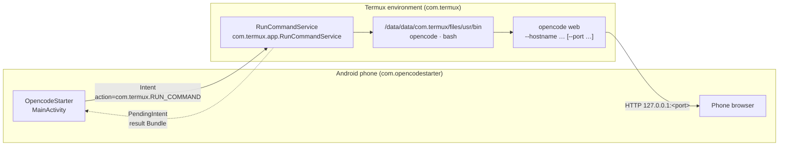
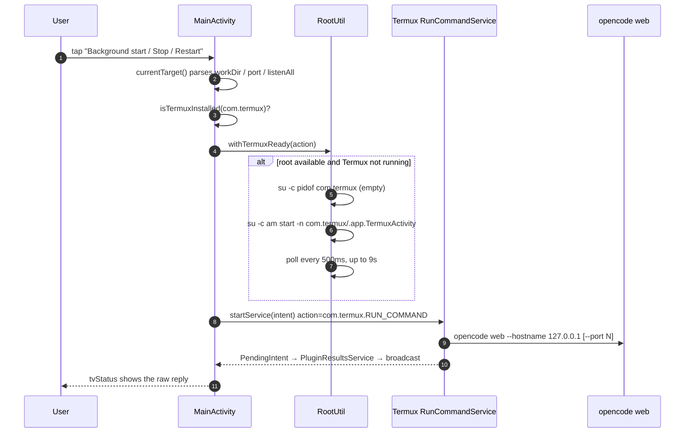
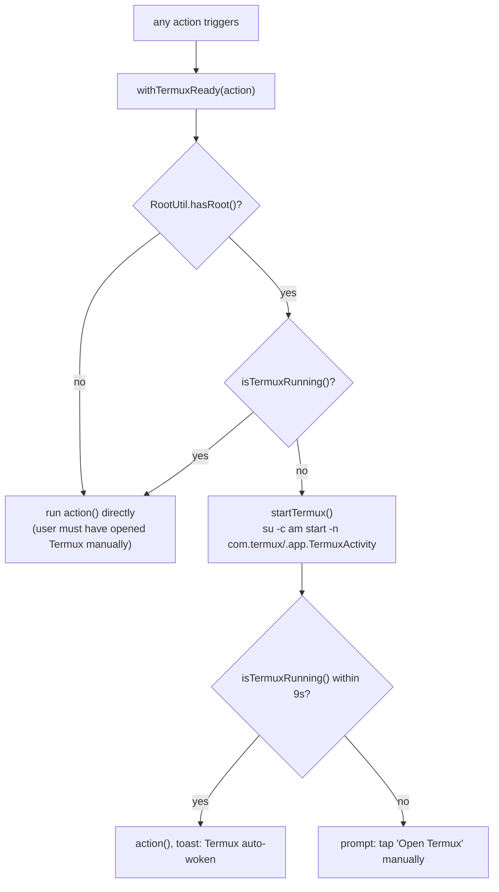
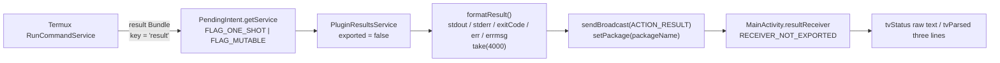

<div align="center">

> **English** | [简体中文](./README.md)


# OpencodeStarter — An Android remote for opencode web

**Two taps on your phone and `opencode web` is running inside Termux — start, probe, stop, restart, plus root-powered auto-wake.**

It squeezes the whole "open Termux → type the command → watch logs → copy the URL" ritual into two taps on your phone.


</div>

---

## Why it exists

[opencode](https://opencode.ai)'s `web` subcommand spins up a local web UI (bound to `127.0.0.1` by default), which is a joy to drive from a phone browser. But on Android, launching it means opening Termux, typing `opencode web`, scanning the logs for the `Web interface:` line to get the port, and hunting down the process again when you want to stop it.

Worse: **when Termux isn't already running, a `RUN_COMMAND` sent by an external app gets silently swallowed by the system** (you tap, nothing happens). And on ROMs like Oplus / ColorOS, pulling Termux to the foreground from another app pops a "Open Termux?" confirmation dialog.

**OpencodeStarter is a graphical remote.** It doesn't run opencode itself — it uses Termux's official [`RUN_COMMAND` Intent](https://github.com/termux/termux-app/wiki/RUN_COMMAND-Intent) to send start / probe / stop / restart commands into Termux and reads the results back for display. With root, it also auto-starts a cold Termux before sending anything (over the shell channel, **no cross-app dialog**).

> It is a **backend-less, network-less, account-less** local tool: it collects nothing and uploads nothing, and uses a single permission, `com.termux.permission.RUN_COMMAND` (which you must grant manually in system settings).

---

## ✨ Features

- ▶ **Foreground start**: brings Termux to the front with a visible terminal, so you can read `Web interface: http://127.0.0.1:<port>/` right from the logs.
- ⏸ **Background start**: Termux doesn't steal focus — great when you just want to switch to the browser; the result is delivered back via `PendingIntent`.
- ● **Refresh status**: runs a **read-only** probe script on the Termux side (`pgrep` + optional `curl`), showing both the raw output and a parsed "running / PID / URL" block.
- ■ **Stop**: runs `pkill -f 'opencode (web|serve)'` behind a confirmation dialog, and is **idempotent** (hammering it is safe).
- 🔁 **Restart**: stop, then relaunch with the current inputs and the last used mode — in one step.
- 🎛 **Controllable launch args**: working directory (empty = Termux `HOME`), port (empty = `--port` not passed, left to opencode; otherwise validated `1-65535`), and an `0.0.0.0` listen toggle (LAN-accessible, defaults to `127.0.0.1` only).
- 🐚 **Root auto-wake** (optional): with root, it probes whether Termux is alive before every command and launches it via `su` when it isn't — fully automatic, no dialog. Without root it falls back to the manual "Open Termux" path with no feature loss.
- 🪶 **Lightweight**: classic Views + Material3, no Compose, ~5 MB APK, correct in both light and dark themes.

---

## 🖥️ Screenshots

<table>
<tr>
<td align="center"><br/><sub>Main screen: launch / status / control / help</sub></td>
<td align="center"><br/><sub>Probe succeeded: running / PID / URL</sub></td>
</tr>
<tr>
<td align="center"><br/><sub>Foreground start: the Web interface line</sub></td>
<td align="center"><br/><sub>opencode Web UI opened in the phone browser</sub></td>
</tr>
</table>

---

## 🚀 Quick Start

### Option 1: For AI agents (one-shot install, recommended)

Paste the following prompt to your local AI agent (Claude Code / Codex / OpenCode …) and let it build and install for you:

````markdown
Please build and install OpencodeStarter on this machine (GitHub: https://github.com/RayMorTwinkle/OpencodeStarter).
Context: this is an Android app (Kotlin + Gradle, no Compose) that remotely starts / probes / stops / restarts
`opencode web` inside Termux via the RUN_COMMAND Intent; with root it also auto-wakes a cold Termux.

Steps:
1. Clone: git clone https://github.com/RayMorTwinkle/OpencodeStarter.git && cd OpencodeStarter
2. Verify the environment: JDK 17 and an Android SDK (needs compileSdk 36 and matching build-tools).
3. Configure the SDK path: export ANDROID_HOME=<your Android SDK path>, or write sdk.dir=... in local.properties.
4. Build a debug APK: ./gradlew assembleDebug
5. Enable USB debugging, connect the phone, then install: adb install -r app/build/outputs/apk/debug/app-debug.apk
6. Remind the user of the three prerequisites:
   a) In Termux: `echo 'allow-external-apps = true' >> ~/.termux/termux.properties` and restart Termux;
   b) System settings → Apps → OpencodeStarter → Additional permissions → enable "Run commands in Termux";
   c) Termux must stay resident in the background (with root the app wakes it automatically, so this can be skipped).
7. Confirm success and briefly explain the five actions: foreground start / background start / refresh status / stop / restart.
````

### Option 2: For humans

```bash
git clone https://github.com/RayMorTwinkle/OpencodeStarter.git
cd OpencodeStarter

export ANDROID_HOME=/opt/homebrew/share/android-commandlinetools   # replace with your Android SDK path

./gradlew assembleDebug     # debug APK: app/build/outputs/apk/debug/app-debug.apk
./gradlew assembleRelease   # release APK (optional, needs keystore.properties, see below)

adb install -r app/build/outputs/apk/debug/app-debug.apk
```

> **Requirements**: an Android phone (`minSdk 26` / Android 8.0+), [Termux 0.118.x](https://github.com/termux/termux-app) (the **GitHub build**, not the Play Store one), and a working `opencode` inside Termux.
> Building needs JDK 17 and an Android SDK (`compileSdk 36`, AGP 8.7.3, Kotlin 2.0.21).

### Three prerequisites before first use

1. **Allow external commands** — run once inside Termux:
   ```bash
   echo 'allow-external-apps = true' >> ~/.termux/termux.properties
   ```
   then restart Termux (or run `termux-reload-settings`).
2. **Grant the additional permission** — System settings → Apps → OpencodeStarter → Additional permissions → enable **Run commands in Termux**.
3. **(Optional, recommended) root** — grant root to OpencodeStarter (allow in KernelSU / Magisk). Afterwards a cold Termux is auto-launched with zero manual steps and zero dialogs.

Then open the app: leave the inputs blank, tap **Background start**, then **Refresh status**; seeing `running: yes` means success. Open `http://127.0.0.1:<port>/` in the phone's browser (the port is decided by opencode — read the `Web interface:` line in the Termux window).

---

## 🖥️ Usage

### The five actions

| Action | What it does | When to use |
|---|---|---|
| ▶ Foreground start | Brings Termux to the front; `opencode web` runs in a visible terminal | You want to watch logs / first-time debugging |
| ⏸ Background start | Termux stays in the background; the result comes back to the app | Start it, then go straight to the browser |
| ● Refresh status | Runs a read-only probe, showing raw output + parsed lines | Unsure whether it's still running |
| ■ Stop | `pkill -f 'opencode (web\|serve)'` (idempotent) | Clean up when done |
| 🔁 Restart | Stop + relaunch with current inputs / last mode | Change port or working directory |

### Launch arguments

| Field | Rule | When empty |
|---|---|---|
| Working directory | Prefer an absolute path (e.g. `/data/data/com.termux/files/home/proj`); non-absolute paths trigger a toast | Termux default `~/` (`WORKDIR` not sent) |
| Port | `1-65535`; an invalid value toasts and aborts | `--port` not appended; the port is left to opencode |
| Listen on 0.0.0.0 | When checked, uses `--hostname 0.0.0.0`, LAN-accessible | `--hostname 127.0.0.1` only |

### Typical workflow

```text
Background start (blank) ──► Refresh status (yes/PID/URL) ──► Browser at 127.0.0.1:port
                                                              │
                        change port/dir ◄── Restart ──────────┘
                                                              │
                                        done ──► Stop
```

---

## 🏗️ Architecture

### System overview

The app is nothing but a "command launcher": commands travel via the `RUN_COMMAND` Intent to Termux's `RunCommandService`, which executes `opencode` or `bash` inside the Termux environment; opencode's HTTP server is then reached from the phone browser.



### Start / stop control flow

Using "background start" as the example: parse inputs → check Termux → (with root, ensure Termux is ready) → send `RUN_COMMAND` → Termux executes and replies.



### Status probe flow

"Refresh status" runs a read-only script on the Termux side: `pgrep` to find the process, then `curl` (when the port is known) to check the HTTP status code. The app parses the reply into three lines.

```mermaid
flowchart TD
  A["tap Refresh status"] --> B{"Port field valid?"}
  B -->|"non-empty & invalid"| B1["toast: enter 1-65535"] --> Z["abort"]
  B -->|empty| C["probe(port = null)"]
  B -->|"1-65535"| D["probe(port = N)"]
  C --> E["bash -c：<br/>pgrep -af 'opencode (web&#124;serve)'; echo ---; echo no-port-specified"]
  D --> F["bash -c：<br/>pgrep …; curl -s -o /dev/null -w '%{http_code}' http://127.0.0.1:N/"]
  E --> G["PluginResultsService receives result Bundle"]
  F --> G
  G --> H["parseProbe()：filter pgrep lines<br/>→ running / PID / URL"]
```



### Root auto-wake decision

Every action first goes through `withTermuxReady()`: without root it runs immediately (legacy path); with root it ensures Termux is alive first.



### Result feedback pipeline

Termux supports result delivery **only via `PendingIntent`** (not `ResultReceiver`). The reply first reaches this app's `PluginResultsService`, is formatted, and is then delivered to `MainActivity` through a same-package explicit broadcast.



---

## 📂 Project layout

```text
OpencodeStarter/
├── app/
│   ├── build.gradle.kts                 # namespace/version/signing/minSdk26·targetSdk34·compileSdk36
│   └── src/main/
│       ├── AndroidManifest.xml          # RUN_COMMAND permission + com.termux queries + Service
│       ├── java/com/opencodestarter/
│       │   ├── MainActivity.kt          # 4-card UI, input validation, withTermuxReady, reply parsing
│       │   ├── TermuxCommand.kt         # RUN_COMMAND Intent assembly (extra keys / args / PendingIntent)
│       │   ├── PluginResultsService.kt  # receives result Bundle → formats → same-package broadcast
│       │   └── RootUtil.kt              # su probe / wake Termux / bring to foreground
│       └── res/
│           ├── layout/activity_main.xml # four MaterialCardViews: launch/status/control/help
│           ├── values/themes.xml        # Theme.Material3.DayNight.NoActionBar; teal/status colors + OC.SectionTitle/OC.Mono styles
│           └── drawable*/               # button icons, status box background (incl. night variant)
├── docs/screenshots/                    # main / running / Termux logs / Web UI
├── gradle/libs.versions.toml            # version catalog: agp 8.7.3 / kotlin 2.0.21 / material 1.12.0
├── build.gradle.kts / settings.gradle.kts
└── gradlew / gradle/wrapper/            # Gradle Wrapper
```

---

## 🔧 Technical notes

**It really is just an "Intent launcher".** All Termux interaction lives in `TermuxCommand.kt`, targeting Termux **0.118.3 / the official Wiki** (the `master` branch adds a few extras that 0.118.x doesn't have — don't copy those):

| Item | Value |
|---|---|
| action | `com.termux.RUN_COMMAND` (note: **not** `com.termux.app.action.RUN_COMMAND`) |
| component | `com.termux` / `com.termux.app.RunCommandService` |
| Sender permission | `com.termux.permission.RUN_COMMAND` (manifest + manual grant in system settings) |

| Extra key | Type | How this app uses it |
|---|---|---|
| `com.termux.RUN_COMMAND_PATH` | String, mandatory | `…/usr/bin/opencode` or `…/usr/bin/bash` |
| `com.termux.RUN_COMMAND_ARGUMENTS` | String[] | `["web","--hostname","127.0.0.1","--port","N"]` |
| `com.termux.RUN_COMMAND_WORKDIR` | String | sent only when non-empty (empty = Termux `~/`) |
| `com.termux.RUN_COMMAND_BACKGROUND` | boolean | foreground `false`; background / probe / stop `true` |
| `com.termux.RUN_COMMAND_SESSION_ACTION` | String `"0"` | foreground start only (switch to a new session and open Termux) |
| `com.termux.RUN_COMMAND_COMMAND_LABEL` | String | command label, e.g. "OpencodeStarter 后台启动" |
| `com.termux.RUN_COMMAND_PENDING_INTENT` | PendingIntent | result channel for background / probe / stop |

**The result Bundle.** The outer key is `result`, containing `stdout` / `stderr` / `exitCode`(int) / `err`(int, `-1` = OK) / `errmsg` / `stdout_original_length` / `stderr_original_length`. `am startservice` cannot construct a `PendingIntent`, so it can't receive replies — **you must go through Java/Kotlin code**.

**Why a reply may never arrive.** The `PendingIntent` uses `FLAG_ONE_SHOT`, so the `requestCode` (the `executionId`) **must be unique every time** or only the first reply lands; `executionId` starts at `1000` and increments via `PluginResultsService.nextExecutionId()`. On SDK ≥ S, `FLAG_MUTABLE` is added.

**Three scripts.**
```bash
# opencode arguments
web --hostname <127.0.0.1|0.0.0.0> [--port <N>]

# probe (port known)
pgrep -af 'opencode (web|serve)'; echo ---; curl -s -o /dev/null -w '%{http_code}\n' http://127.0.0.1:<port>/
# probe (port empty: pgrep only, no curl)
pgrep -af 'opencode (web|serve)'; echo ---; echo no-port-specified

# stop (idempotent)
pkill -f 'opencode (web|serve)'; echo exit=$?
```

**Input validation.** An empty port = `null` (`--port` not passed, left to opencode); a non-empty port must be `1..65535`, otherwise it returns the `INVALID = -1` sentinel, toasts, and aborts. An empty or non-absolute working directory (not starting with `/`, `~`, `$PREFIX`) only triggers a toast — it does not block.

**Root auto-wake timing.** `RootUtil.hasRoot()` takes ~100–200 ms the first time (result cached, so it's warmed up on a background thread to keep the UI smooth); after launching Termux, `withTermuxReady()` polls every `500 ms` with a total deadline of `9000 ms`, then prompts for a manual start on timeout. Every `su -c` call is bounded by `exec(cmd, timeoutSec)`, with `destroyForcibly()` on timeout. `RootUtil.exec` truncates output to 2000 chars; `PluginResultsService.formatResult` truncates to 4000 chars.

**Foreground vs. background, essentially.** The only difference is two extras: foreground start uses `BACKGROUND=false` + `SESSION_ACTION="0"` (Termux is pulled forward; its reply is an unreliable mixed transcript, so the app tells you to read the Termux window instead), while background start uses `BACKGROUND=true` + `PENDING_INTENT` (no focus stealing, reliable reply).

**One build-side compromise.** AGP's lint cannot run under JDK 26 (`lintVitalAnalyzeRelease` fails with `"26.0.2.1"`), and this project is small and unminified, so `lint { checkReleaseBuilds = false }`. `release` does not enable `minifyEnabled`.

---

## ❓ FAQ

**Q: I tapped the button and nothing happened.**
A: Check the trio — ① `allow-external-apps=true` inside Termux; ② the "Run commands in Termux" additional permission granted in system settings; ③ Termux resident in the background (auto-satisfied when you have root).

**Q: Oplus / ColorOS shows "Open Termux?".**
A: Without root, cross-app launches prompt once on first use — choose "Always allow". With root it goes through the `su` shell channel and never prompts.

**Q: No execution reply at all?**
A: Make sure Termux ≥ 0.109 (older versions don't support `PendingIntent` replies). Also note that `ResultReceiver` and the `am` command never had a reply channel — use the in-app buttons.

**Q: Why can't I see a reply for foreground start?**
A: Foreground output is a mixed stdout + stderr transcript and is unreliable via `PendingIntent`, so the app points you to the `Web interface:` line in the Termux window.

**Q: I set a port but the browser won't open it.**
A: The port may be taken. Change the port and hit "Restart", or manually `pkill -f 'opencode (web|serve)'` in Termux. An empty port passes no `--port` and the port is decided by opencode — always read the URL from the Termux logs.

**Q: Is root required?**
A: No. Root is only used to auto-wake Termux and to bring it to the foreground without a dialog. Without root, tap "Open Termux" once, leave it in the background, and everything else works exactly the same.

---

## ⚠️ Notes

- **Don't use the Play Store Termux**: `RUN_COMMAND` needs the GitHub build (0.118.x verified).
- **targetSdk ≥ 30 package visibility**: this app declares `com.termux` via `<queries>` in `AndroidManifest.xml`; if you remove it in a fork, the Intent will never be delivered.
- **Aggressive Chinese ROMs**: add Termux to the battery-optimization allowlist to avoid it being killed in the background.
- **Reply truncation**: on the Termux side, `stdout + stderr` are truncated at roughly 100 KB combined; for longer output, read the Termux window or redirect to a file.
- **A foreground session won't exit itself**: Termux's back button only returns to the app; the opencode session keeps running. Use "Stop" explicitly.
- This app **collects and uploads nothing**; its root capability is used solely to wake Termux and never reads user data.

---

## 📄 License

[MIT](./LICENSE) © 2026 RayMorTwinkle

---

## 🙏 Credits

- All Termux interaction follows the official [RUN_COMMAND-Intent Wiki](https://github.com/termux/termux-app/wiki/RUN_COMMAND-Intent); this project's extra-key table targets **Termux 0.118.3**.
- Thanks to [Termux](https://github.com/termux/termux-app) and [opencode](https://opencode.ai) — this project is just a thin Android remote gluing the two together.
- The icon, the bilingual README, and the architecture diagrams were produced for this project.

---

## 🧪 Real-device testing

Environment: **OPD2513 / Android 16 / Termux 0.118.3 / opencode 1.18.21**

- Background start (blank inputs) → `opencode web --hostname 127.0.0.1`, `ss` shows `127.0.0.1:4096 LISTEN`.
- Refresh status → `[probe #1001] exit=0 err=-1`, parsed as "running: yes / PID: 19534".
- Stop → `pgrep` is empty; restart → a new PID appears; repeated "Stop" taps never error (idempotent).
- Foreground start → Termux on top, showing `Web interface: http://127.0.0.1:42507/`.
- Root cold start (after `force-stop com.termux`, tap background start directly) → Termux and opencode come up fully automatically with zero dialogs.

---

<div align="center">
<sub>OpencodeStarter · Your phone is the remote for opencode.</sub>
</div>
